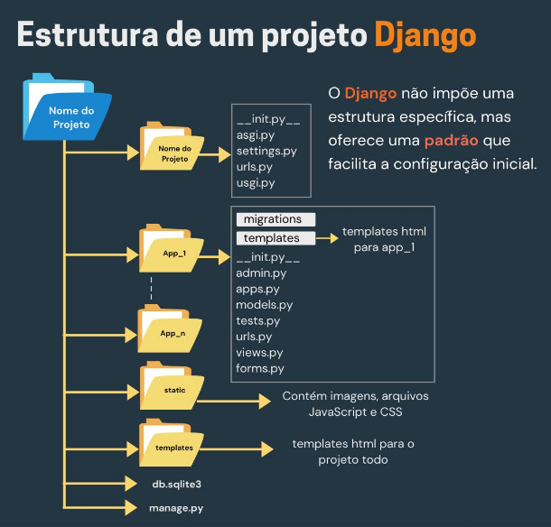

## Configurando um Ambiente Virtual

1. Verifique se o Python está instalado: Abra seu terminal e execute o seguinte comando para verificar se o Python está instalado:

   ```bash
   python --version
   ```

      Nota: Se o Python não estiver instalado, faça o download e instale [aqui](https://www.python.org/downloads/).

2. Execute o seguinte comando para criar um ambiente virtual chamado `venv`:

   ```bash
   python -m venv venv
   ```

3. Ative o ambiente virtual usando o comando:

   ```bash
   .\venv\Scripts\activate
   ```
    O comando para sair de um ambiente virtual (venv) em Python é: `deactivate`

## Instalando Dependências

- Instale as dependências listadas no arquivo `requirements.txt` usando o seguinte comando:

   ```bash
   pip install -r requirements.txt
   ```

## Configuração de Credenciais

Para configurar as credenciais necessárias para executar o projeto `projeto-django`, você precisará configurar as variáveis de ambiente correspondentes. Siga as instruções abaixo para configurar o arquivo `.env`.

1. Na raiz do seu repositório, crie um novo arquivo chamado `.env`.

2. No arquivo `.env`, você configurará as variáveis de ambiente para o seu projeto.

## Executando o projeto Django

Para iniciar o servidor de desenvolvimento do seu projeto Django, siga as etapas abaixo:

1. Certifique-se de que o ambiente virtual está ativado. Você verá algo como (`venv`) antes do prompt de comando.

2. No terminal, navegue até o diretório raiz do seu projeto Django, onde o arquivo `manage.py` está localizado.

3. Execute o comando a seguir para iniciar o servidor de desenvolvimento:
   ```bash
   python manage.py runserver
   ```
   O servidor de desenvolvimento será iniciado e estára disponível no endereço http://127.0.0.1:8000/.

## Como usar linters localmente:
### Isort

```bash
isort ./projeto ./home
```
### Black

```bash
black --line-length 120 ./projeto ./home
```

### Flake8

```bash
flake8 ./projeto ./home
```

## Estrutura do Projeto

Abaixo está a estrutura do projeto Django, ilustrada na imagem. Esta estrutura segue a organização comum para projetos Django, com diretórios separados para a configuração do projeto, aplicações, arquivos estáticos, templates, entre outros.



## Comandos Comuns do Terminal para Projetos Django

| Comando                                  | Descrição                                                                                       |
|------------------------------------------|-------------------------------------------------------------------------------------------------|
| `django-admin startproject projectname`  | Cria um novo projeto Django com o nome especificado.                                            |
| `python manage.py startapp appname`      | Cria uma nova aplicação dentro do projeto Django.                                               |
| `python manage.py runserver`             | Inicia o servidor de desenvolvimento do Django.                                                 |
| `python manage.py migrate`               | Aplica as migrações de banco de dados, criando ou alterando tabelas conforme necessário.        |
| `python manage.py makemigrations`        | Cria novas migrações com base nas mudanças feitas nos modelos do projeto.                       |
| `python manage.py createsuperuser`       | Cria um superusuário para acessar a administração do Django.                                    |
| `python manage.py shell -i ipython`                 | Inicia um shell interativo do Django, permitindo executar código Python com o contexto do projeto. |
| `python manage.py collectstatic`         | Coleta arquivos estáticos de todas as aplicações em um único local para servir em produção.     |
| `python manage.py test`                  | Executa os testes automatizados do projeto Django.                                              |
| `python manage.py showmigrations`        | Mostra uma lista de todas as migrações e seu status.                                            |
